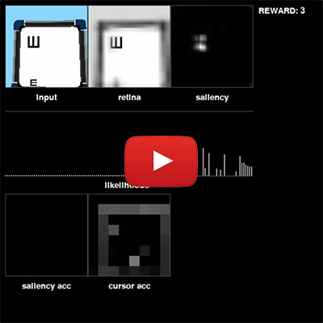
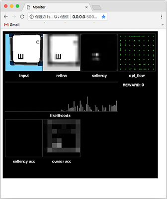
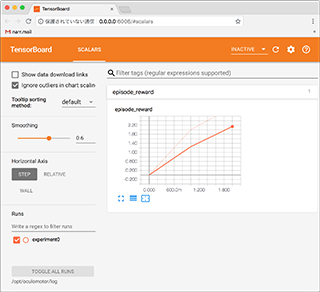

# oculomotor
WBAI 2018 Hackathon Oculomotor Project Repository.

[](https://youtu.be/WH7AUJzk70o)

## Requirements
### Docker
[How to install](https://docs.docker.com/install/)

After successfull install, you should be able to run `docker ps` and get something like this:

```
$ docker ps
CONTAINER ID        IMAGE               COMMAND             CREATED             STATUS              PORTS               NAMES
```

## Usage
The code can be executed in two modes: the interactive mode and batch training mode.

### Common Instructions
#### Clone this repository
```
$ git clone --recursive https://github.com/wbap/oculomotor
```

#### Build the docker containers
```
# warning: if you use GPU, you need nvidia-docker2
$ cd oculomotor
$ build-gpu.sh or build-cpu.sh
```

#### Edit the files under `application/functions` as you like

### Train beta-VAE
First of all, dataset gathered by `../data/gen.py`.
```
$ ./download_data.sh <id> <file name>
# id list
# PointToTarget: 1PkkCUE5pbgcqF23YF6UEhMijtP-ISGBx
# ChangeDetection: 1AIu3TFdl0lf5c1I3-fLn6dh6aMElOycc
# OddOneOut: 1-az2ZcoVhr5vlEApQ7Rg9bTqHQYCbaxn
# VisualSearch: 18auSTtm2-VTxNUNWIV-BD0gcslRpQSSX
# MultipleObjectTracking: 12fM_HQUwSwEP4NcDRhrQyjSquDCNX_Db
# RandomDot: 1F3QMDOvpOvxguUUIet6f2IjOTF_SUYwa
```

Then, train beta-vae.
```
# ./helpers/gpu_train_vae.sh on GPU
$ ./helpers/train_vae.sh --modeldir <dirname> --data <above dataset>
```

Then, you see trained weights at `./saved_models/<dirname>`.

### Running in Interactive Mode
#### Run the container using the helper script


flask server starts child process to run trainning. This enables interactive mode to run much faster.
Info request from js is removed to reduce number of requests, which also enables users to browse training from middle of training.
```
$ ./helpers/interactive.sh
# on GPU
$ ./helpers/gpu_interactive.sh
```

#### Open the monitor interface in the browser
Access the monitor. [http://0.0.0.0:5000/monitor/index.html](http://0.0.0.0:5000/monitor/index.html)




### Running in Batch Training Mode

#### Run the container using the helper script
```
 $ ./helpers/train.sh --content=1 --step_size=1000000 --log_file=experiment0
 # on GPU
 $ ./helpers/gpu_train.sh --content=1 --step_size=1000000 --log_file=experiment0
```

### Show training graph

#### Show training graph with TensorBoard tool.
```
 $ ./helpers/board.sh
 # on GPU
 $ ./helpers/gpu_board.sh
```
Access the log page. [http://0.0.0.0:6006/](http://0.0.0.0:6006/)




### Run Final Evaluation

#### Run the container using the helper evaluation script
```
 $ ./helpers/evaluate.sh --log_file=evaluate0
```
